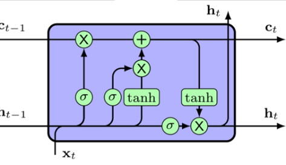
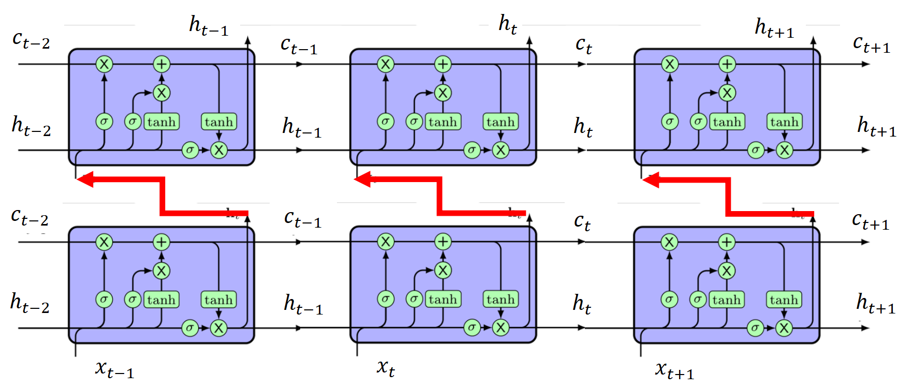

# 实验：一层和多层的LSTM的不调库实现

此次实验我们采用Pytorch环境，在不调用 `torch.nn.LSTM()`的情况下复刻一个LSTM，并进行相应的训练操作。

## 模型设计

### 单层

先放一张LSTM单元的结构图：



对 `forward()`而言，构造应如图所示，首先要对输入的词汇进行编码-向量化处理，形成$x_t$。然后，进行处理：

```python
            input_gate = torch.sigmoid(self.W_ii(X_t)+self.b_ii+self.W_hi(hidden_state)+self.b_hi)
            forget_gate = torch.sigmoid(self.W_if(X_t)+self.b_if+self.W_hf(hidden_state)+self.b_hf)
            cell_gate = torch.tanh(self.W_ig(X_t)+self.b_ig+self.W_hg(hidden_state)+self.b_hg)
            output_gate = torch.sigmoid(self.W_io(X_t)+self.b_io+self.W_ho(hidden_state)+self.b_ho)
            cell_state = forget_gate*cell_state+input_gate*cell_gate;
            hidden_state = output_gate*torch.tanh(cell_state);
```

从上到下分别是输入门，遗忘门，记忆门，输出门，记忆层和隐藏层的更新。最后对输出门再做一轮变换，即得到我们要输出的东西，再开始处理下一组数据，循环往复。

这样就得到了目标代码：

```python
class TextLSTM(nn.Module):
    def __init__(self,n_class,emb_size):
        super(TextLSTM,self).__init__()
        self.C=nn.Embedding(n_class,embedding_dim=emb_size);
        self.W=nn.Linear(n_hidden,n_class,bias=False)
        self.b=nn.Parameter(torch.ones([n_class]))

        self.W_ii=nn.Linear(emb_size,n_hidden,bias=False)
        self.W_if=nn.Linear(emb_size,n_hidden,bias=False)
        self.W_ig=nn.Linear(emb_size,n_hidden,bias=False)
        self.W_io=nn.Linear(emb_size,n_hidden,bias=False)
        self.b_ii=nn.Parameter(torch.ones([n_hidden]))
        self.b_if=nn.Parameter(torch.ones([n_hidden]))
        self.b_ig=nn.Parameter(torch.ones([n_hidden]))
        self.b_io=nn.Parameter(torch.ones([n_hidden]))

        self.W_hi=nn.Linear(n_hidden,n_hidden,bias=False)
        self.W_hf=nn.Linear(n_hidden,n_hidden,bias=False)
        self.W_hg=nn.Linear(n_hidden,n_hidden,bias=False)
        self.W_ho=nn.Linear(n_hidden,n_hidden,bias=False)
        self.b_hi=nn.Parameter(torch.ones([n_hidden]))
        self.b_hf=nn.Parameter(torch.ones([n_hidden]))
        self.b_hg=nn.Parameter(torch.ones([n_hidden]))
        self.b_ho=nn.Parameter(torch.ones([n_hidden]))
    def forward(self,X):
        X=self.C(X);
        hidden_state = torch.zeros(1, len(X), n_hidden)  # [num_layers(=1) * num_directions(=1), batch_size, n_hidden]
        cell_state = torch.zeros(1, len(X), n_hidden)
        X=X.transpose(0,1);

        for X_t in X:
            input_gate = torch.sigmoid(self.W_ii(X_t)+self.b_ii+self.W_hi(hidden_state)+self.b_hi)
            forget_gate = torch.sigmoid(self.W_if(X_t)+self.b_if+self.W_hf(hidden_state)+self.b_hf)
            cell_gate = torch.tanh(self.W_ig(X_t)+self.b_ig+self.W_hg(hidden_state)+self.b_hg)
            output_gate = torch.sigmoid(self.W_io(X_t)+self.b_io+self.W_ho(hidden_state)+self.b_ho)
            cell_state = forget_gate*cell_state+input_gate*cell_gate;
            hidden_state = output_gate*torch.tanh(cell_state);
        outputs=output_gate[-1]
        model=self.W(outputs)+self.b;
        return model;
  
```

难点在于对几个乘法参数的维数的分析上。传入的 `X_t`的长度是 `n_class`也就是一篇语料的长度，然后要和运算后维度不变的隐藏层拼接，因此就要调定几个 `nn.Linear`的两个参数，其次运算完的结果还要还原回 `n_class`的长度。

### 多层



多层LSTM的要点在于除了第一层之外，传入的需要和前一层的隐藏层拼在一起。

一开始我试图在 `__init__`里把声明的几个 `nn.Parameter`和 `nn.Linear`全部变成数组，然后在循环里添加几个切片操作就完事了。但后来发现 `nn.Module`类不允许这么干。

后来我发现了这个东西：`nn.Sequential`。此类允许多个 `nn.Module`串联运行，目标内容在该类第一个单元运算后传递到下一个单元继续运算。那么这样的话多层的实现就显得很简单：

1. 需要在一些单元的最后将 `model`和隐藏层拼在一起，输出的维度变为 `n_class+n_hidden`；
2. 需要重新考虑维度，分出三类 `nn.Module`对象，一是开头：`n_class -> n_class+n_hidden`；二是中间：`n_class+n_hidden -> n_class+n_hidden`；三是结尾：`n_class+n_hidden -> n_class`。
3. 另外就是需要存档，即保存每层在每个语料的运算中使用的 `hidden_state`和 `cell_state`。这里使用两个全局二维数组：

   ```python
   tensors:List[List[torch.Tensor]] = list();
   cells:List[List[torch.Tensor]] = list();
   ```
4. 最后，需要在存储时去除 `hidden_state`和 `cell_state`的梯度属性，以免计算无关梯度干扰结果。

最后成功的生成了一个可以任意调节层数的LSTM模型。

### 心得

这次开发主要的难点在复现多层上。一开始几乎要被这种结构整得死去活来，因为当时不知道 `nn.Sequential`的存在。后来在反复翻看几个网上的pytorch资料的时候发现了这玩意，及时扭转了局面，当时差一点就放弃了。之后实践这几个类的时候我当时也没文档——一开始我甚至不能确定 `nn.Sequential`是不是能适配自己写的 `nn.Module`——，然后做了几个实验（实验文件也在文件夹里，不过不少代码已经无了），所以说**pytorch的学习最主要还是实验，了解完原理，几个函数怎么用需要自己实验。** 当然全是实验也不能搞懂这玩意具体怎么搞的，最后还是上官网查了一下定义，但几天后我了解了 `help()`发现我看到的用 `help`自己也能看。那就没办法了。
